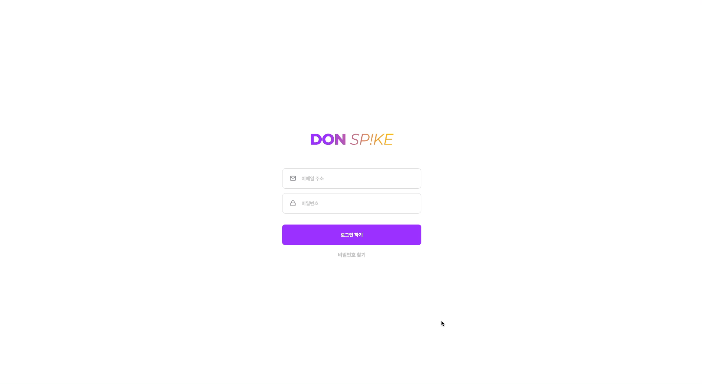
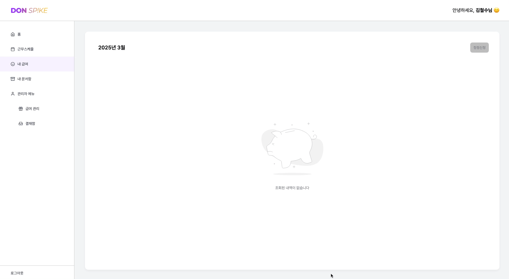
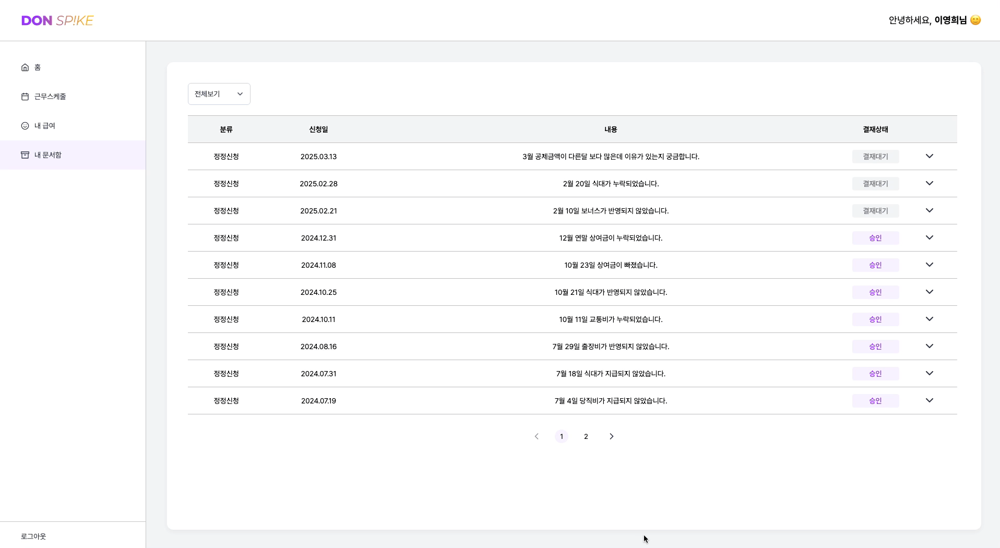
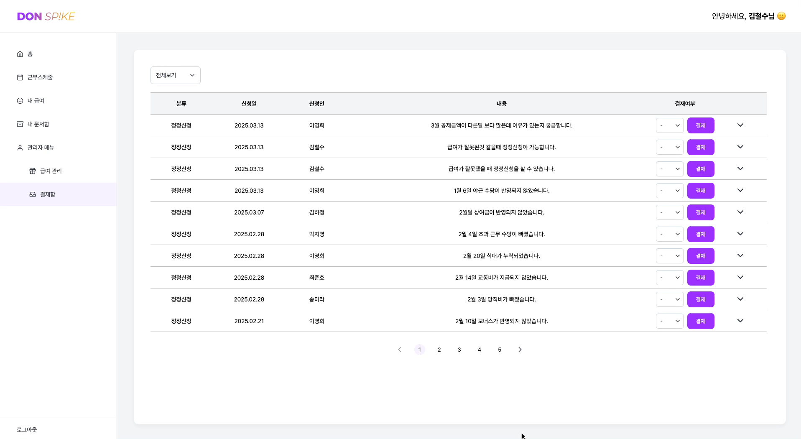

# 돈이 닿는 순간, DON SP!KE


&nbsp;

## ✨ 프로젝트 소개
[DON SP!KE 둘러보기](https://venerable-beijinho-f4a0c4.netlify.app)

### 돈이 스파이크처럼 정확하게 닿는 순간 — Don Sp!ke 🏐
> **관리자가 보내고, 직원이 확인하고, 모두가 안심하는 급여 관리** <br>
> **급여, 일정, 정정까지. 복잡한 돈 이야기를 쉽게**

&nbsp;

## 👨‍🚀 팀소개

<div align="center">

|  |  |  |  |
| :---: | :---: | :---: | :---: |
| **💛 [이지선](https://github.com/ijisun)** | **💙 [강준구](https://github.com/jungu0416)** | **💙 [전유진](https://github.com/mirinae700)** | **💙 [최정훈](https://github.com/chjjh0)** |
| **공통** <br/> 와이어프레임 <br/> Firebase 세팅 <br/> **사용자** 내 문서함 <br/> **관리자** 결재함 <br/> 👩‍💻 README 작성 | **공통** <br/> 초기세팅 <br/> 공통 컴포넌트 <br/> 및 레이아웃 <br/> 로그인 <br/> **관리자** 급여관리 <br/> 👩‍🏫 발표자료 제작 | **공통** <br/> 와이어프레임 <br/> 공통 컴포넌트 <br/> 및 레이아웃 <br /> **사용자** <br/> 대시보드, 급여명세서 <br/> 👩‍🎨 디자인 통일화 | **공통** <br/> 초기세팅 <br/> 라우팅 샘플 제작 <br/> **사용자** 근무스케줄 <br/> 👨‍🎓 발표자 <br> 👩‍🏫 발표자료 제작 |

</div>

&nbsp;

## 🚀 주요 페이지와 기능

### 로그인, 대시보드
- 프로필 정보 확인
- 휴가 정보 조회
- 평균 근무시간 확인
- 급여 정정 신청 내역 조회
- 개인 체크리스트

  

### 근무스케줄
- 캘린더를 통한 근무 일정 조회 및 관리

  

### 내 급여
- 월별 급여 명세서 확인 및 급여 정정 신청

  

### 내 문서함
- 나의 급여 정정 신청 내역 조회 및 결재 상태 확인

  

### 관리자 - 급여 관리
- 급여 대상자 확인 및 급여 전송
- 기본급, 추가수당 관리

  

### 관리자 - 결재함
- 직원들의 급여 정정 신청 내역 확인 및 결재 처리

  

&nbsp;

## 📁 폴더 구조

```
- 📁 src
  - 📁 app
    - 📁 layout
    - 📁 routes
  - 📁 feature
    - 📁 admin
    - 📁 design-guide
    - 📁 error
    - 📁 home
    - 📁 login
    - 📁 my-document
    - 📁 pay-stub
    - 📁 work-schedule
  - 📁 shared
    - 📁 api
    - 📁 components
    - 📁 constants
    - 📁 hooks
    - 📁 redux
    - 📁 styles
    - 📁 utils
```

&nbsp;

## 🔨 기술 스택

<div align="center">

|      Type       | Tool |
| :-------------: | :---: |
|     Library     |    |
|    Language     |   |
|     Styling     |  |
|   Formatting    |   |
| Package Manager |  |
|   Build Tools   |  |
|   Deployment    |  |
| Version Control |   |
|  Collaboration  |   |
|     Design      |  |

</div>

&nbsp;

## ⚙ 프로젝트 설정 및 실행 방법

### 1. 프로젝트 클론

Git 저장소에서 프로젝트를 로컬로 클론합니다. 터미널(또는 명령 프롬프트)을 열고 명령어를 입력합니다.

```
git clone https://github.com/Dev-FE-3/toy-project2-team1
```

### 2. 의존성 설치

코드 에디터에서 프로젝트 폴더를 열고 터미널에서 'npm' 명령어를 사용하여 의존성을 설치합니다.

```
npm install
```

### 3. 개발 서버 실행

개발 서버를 실행하여 프로젝트를 로컬에서 프로젝트를 실행할 수 있습니다.

```
npm run dev 
```
&nbsp;

⚠️ **중요: Firebase 환경 변수 파일 (`.env`)**

이 프로젝트는 Firebase 설정이 필요하기 때문에 `.env` 파일 없이는 프로젝트가 정상적으로 실행되지 않습니다.

만약 `.env` 파일이 없다면, 프로젝트 소유자에게 직접 요청하여 받아야 합니다.

📩 **`.env` 파일 요청** : 해당 프로젝트의 팀원에게 문의하세요.

&nbsp;

## 💡 팀 컨벤션

### 브랜치 전략

**main, dev, feat** 브랜치 사용

- main : 배포 가능한 상태만을 관리하는 브랜치

- dev : 개발 단계에서 통합 역할을 담당하는 브랜치

- feat : 새롭게 추가되거나 변경되는 기능을 개발, merge 후에는 삭제

  - 브랜치 이름 규칙 : `feat/기능명` e.g. `feat/login`

### 커밋 컨벤션

- `feat` : 새로운 기능 추가

- `fix` : 버그 수정

- `docs` : 문서 수정

- `style` : 코드 포맷팅, 세미콜론 누락, 코드 변경이 없는 경우

- `refactor` : 코드 리펙토링

- `test` : 테스트 코드, 리펙토링 테스트 코드 추가

- `chore` : 빌드 업무 수정, 패키지 매니저 수정

### 파일 컨벤션

- 폴더 : kebab-case

- 파일 : camelCase

### 디자인 가이드


&nbsp;

## ⏰ 프로젝트 진행 과정

### 기획 및 설계 (2025.02.17 ~ 2025.02.18)
- 프로젝트의 주제와 목표를 설정하고 서비스의 기능을 구체화하여 기능 정의 작성

### 초기 세팅 및 와이어프레임 제작 (2025.02.19 ~ 2025.02.21)
- 프로젝트 생성 및 폴더 구조 세팅
- 디자인 가이드 확정 및 전체적인 디자인 작업

### Firebase 세팅 및 공통 컴포넌트 제작 (2025.02.25 ~ 2025.02.26)
- Firebase 세팅
- 공통 컴포넌트 제작 및 레이아웃 세팅

### 기능 구현 (2025.02.27 ~ 2025.03.11)
- 기능 정의를 바탕으로 기능 개발 진행

### 기능 테스트 및 수정 (2025.03.12 ~ 2025.03.13)
- 완성된 기능 통합 테스트 진행 후 버그 수정

&nbsp;